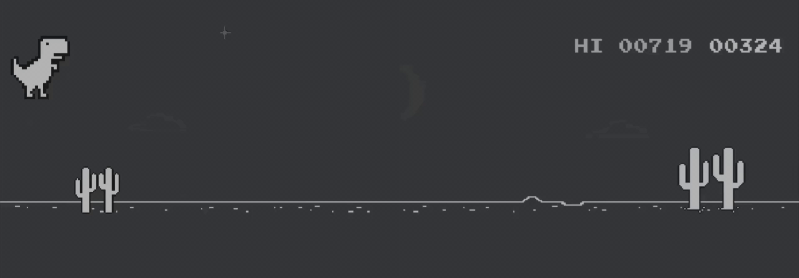

### What's up 👋

Me chamo Sérgio Artifon e tenho 30 anos.

Aqui você terá acesso à todos os meus projetos e atividades
desenvolvidas durante a minha trajetória até me tornar um Desenvolvedor Web.

  <a href="https://github.com/artifonn">
  
  

 
  
  
  
  
  
 

  
  ##
 

 

    
  
<!--     -->
  

